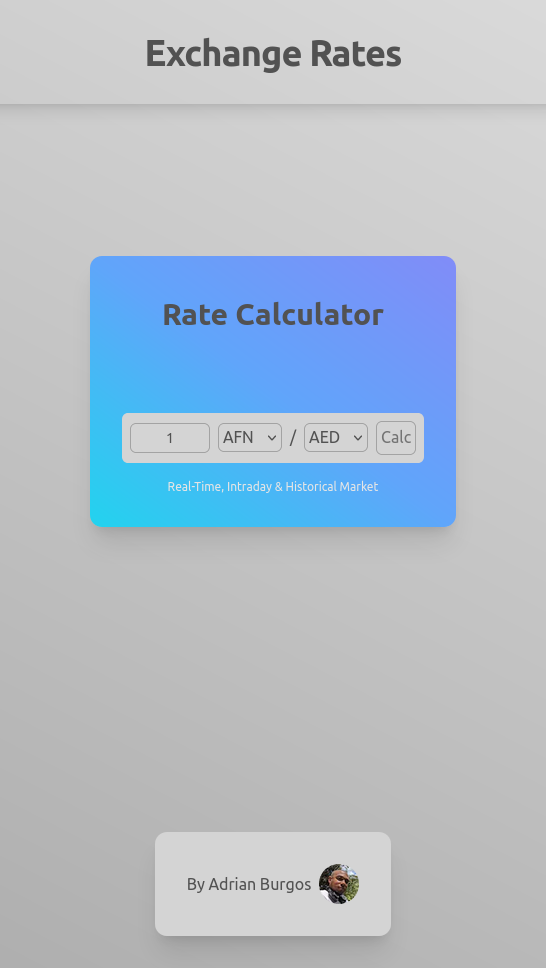

# Fonoma - Frontend Developer Test

This is a solution to the [Fonoma - Frontend Developer Test](https://fonoma.notion.site/Fonoma-Frontend-Developer-Test-72707c63a57c4f1bb89c3c34d774d850). 

## Table of contents

- [Overview](#overview)
  - [Instructions](#Instructions)
  - [Screenshot](#screenshot)
  - [Links](#links)
- [My process](#my-process)
  - [Built with](#built-with)
- [Testing](#testing)
- [Author](#author)

## Overview

### Instructions

1. Create a [NextJS](https://nextjs.org/) basic project following this tutorial: [NextJS - getting started](https://nextjs.org/docs/getting-started).
2. Create a git repository with the code and upload it to Github, Gitlab, or Bitbucket. 
3. In the repository, create a new branch.
4. In the new branch, implement a simple exchange rate calculator, with the following characteristics:
    - An input field for the user to enter the amount to be converted.
    - Two dropdown menus for the user to select the currencies (from and to). You can obtain the list of available currencies from the API **[https://exchangeratesapi.io/](https://exchangeratesapi.io/)**.
    - A button to trigger the conversion.
    - An area to display the converted amount and exchange rate.
    
    **IMPORTANT:** Obtain the list of available currencies as well as the exchange rates using the following API: **[https://exchangeratesapi.io/](https://exchangeratesapi.io/).** The API provides 250 free requests per month; you just need to obtain an API key.
    
5. Write at least one unit test. More unit tests, as well as snapshot tests, will give you bonus points.
6. Create a Pull Request (or Merge Request) of the new branch with a detailed description of the changes made.
7. Deploy the project to [Vercel](https://vercel.com/): See [Introduction to Vercel | Vercel Docs](https://vercel.com/docs).
8. After completing the test and deploying the application, send us an email with the following links:
    - The link to the PR in your repository.
    - The link to the deployed version on [Vercel](https://vercel.com/).

**Bonus points:** Implement a caching mechanism for the fetched exchange rates. For this, assume that the list of available currencies doesn’t change very often and that the exchange rate between two currencies has a validity of ten minutes.

**Bonus points:** Use TypeScript.

**Bonus points:** Use styled-components

### Screenshot

### Links

- Solution URL: [https://github.com/adrianburgoscolas/exchangerate](https://github.com/adrianburgoscolas/exchangerate)
- Live Site URL: [https://exchangerate.vercel.app/](https://exchangerate.vercel.app/)

## My process

### Built with

- Mobile-first workflow
- [React](https://reactjs.org/) - JS library
- [Next.js](https://nextjs.org/) - React framework

## Testing
- To run the Unit Test type `npm run test`

## Author

- Website - [Add your name here](https://www.your-site.com)
- Github - [adrianburgoscolas](https://github.com/adrianburgoscolas)
- Twitter - [@AdrianCoder](https://twitter.com/AdrianCoder)
